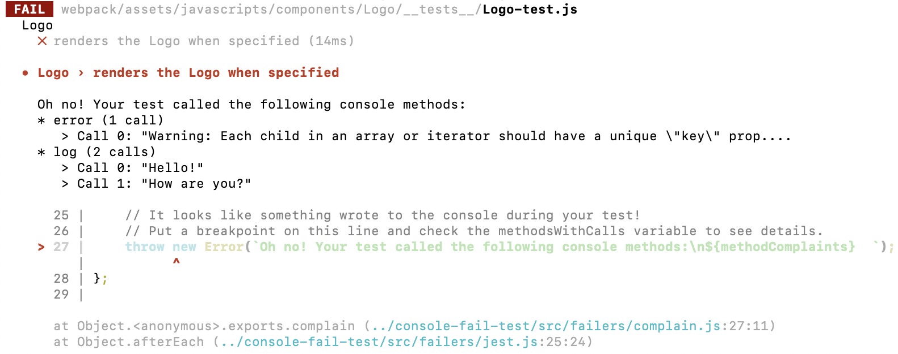

# console-fail-test

Gently fails test runs if the console was used during them.

## Usage

`console-fail-test` is meant to support any (test framework) x (spy library) combination.
It will auto-detect your combination and use the most appropriate environment hooks and function spies it can find.
See [open test framework support issues](https://github.com/RyzacInc/console-fail-test/issues?q=is%3Aissue+is%3Aopen+label%3A%22test+framework+support%22) for progress on more!

### Test Frameworks

<table>
  <thead>
    <tr>
      <td>Framework</td>
      <td>Support?</td>
      <td>Documentation</td>
    </tr>
  </thead>
  <tbody>
    <tr>
      <td>Mocha</td>
      <td>
        ✅️
      </td>
      <td>
        <a href="./docs/Mocha.md">
          <code>Mocha.md</code>
        </a>
      </td>
    </tr>
    <tr>
      <td>Jasmine</td>
      <td>
        ✅️
      </td>
      <td>
        <a href="./docs/Jasmine.md">
          <code>Jasmine.md</code>
        </a>
      </td>
    </tr>
    <tr>
      <td>Jest</td>
      <td>
        ✅️
      </td>
      <td>
        <a href="./docs/Jest.md">
          <code>Jest.md</code>
        </a>
      </td>
    </tr>
    <tr>
      <td>Ava</td>
      <td>
        ⚙️
      </td>
      <td>
        <a href="https://github.com/RyzacInc/console-fail-test/issues/16">
          <code>/issues/16</code>
        </a>
      </td>
    </tr>
    <tr>
      <td>lab</td>
      <td>
        ⚙️
      </td>
      <td>
        <a href="https://github.com/RyzacInc/console-fail-test/issues/20">
          <code>/issues/20</code>
        </a>
      </td>
    </tr>
    <tr>
      <td>node-tap</td>
      <td>
        ⚙️
      </td>
      <td>
        <a href="https://github.com/RyzacInc/console-fail-test/issues/18">
          <code>/issues/18</code>
        </a>
      </td>
    </tr>
    <tr>
      <td>QUnit</td>
      <td>
        ⚙️
      </td>
      <td>
        <a href="https://github.com/RyzacInc/console-fail-test/issues/19">
          <code>/issues/19</code>
        </a>
      </td>
    </tr>
    <tr>
      <td>tape</td>
      <td>
        ⚙️
      </td>
      <td>
        <a href="https://github.com/RyzacInc/console-fail-test/issues/17">
          <code>/issues/17</code>
        </a>
      </td>
    </tr>
    <tr>
      <td>TestCafe</td>
      <td>
        ⚙️
      </td>
      <td>
        <a href="https://github.com/RyzacInc/console-fail-test/issues/15">
          <code>/issues/15</code>
        </a>
      </td>
    </tr>
  </tbody>
</table>

### Spy Libraries

If a supported spy library isn't detected, an internal fallback will be used to spy on `console` methods.

<table>
  <thead>
    <tr>
      <td>Library</td>
      <td>Support?</td>
      <td>Spy</td>
      <td>Documentation</td>
    </tr>
  </thead>
  <tbody>
    <tr>
      <td>Jasmine</td>
      <td>
        ✅️
      </td>
      <td>
        <a href="https://jasmine.github.io/2.0/introduction.html#section-Spies">
          <code>jasmine.createSpy()</code>
        </a>
      </td>
      <td>
        <a href="./docs/Jasmine.md">
          <code>Jasmine.md</code>
        </a>
      </td>
    </tr>
    <tr>
      <td>Jest</td>
      <td>
        ✅️
      </td>
      <td>
        <a href="https://jestjs.io/docs/en/mock-functions.html">
          <code>jest.fn()</code>
        </a>
      </td>
      <td>
        <a href="./docs/Jest.md">
          <code>Jest.md</code>
        </a>
      </td>
    </tr>
    <tr>
      <td>Sinon</td>
      <td>
        ✅️
      </td>
      <td>
        <a href="https://sinonjs.org/releases/latest/spies">
          <code>sinon.spy()</code>
        </a>
      </td>
      <td>
        <a href="./docs/Sinon.md">
          <code>Sinon.md</code>
        </a>
      </td>
    </tr>
  </tbody>
</table>

## Why?

Logging to the console during tests can be a sign of

-   🚫 warnings from third-party libraries such as React for improper usage
-   🤕 temporary code that shouldn't be checked into your project
-   📢 unnecessary spam in your tests window

This little library throws an error after each test if a console method was called during it.
It's got some nifty features:

-   📊 Summary of which methods are called with calling arguments
-   🛫 Failures are thrown _after_ tests finish, so your tests will fail normally if they should

Look how fancy the terminal output is with Jest!

